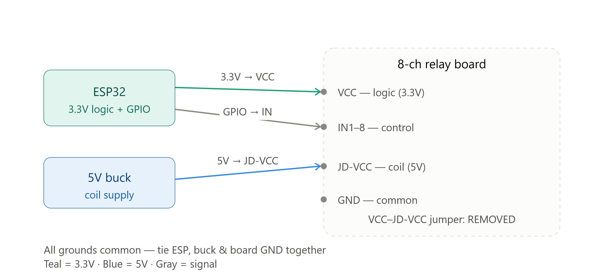
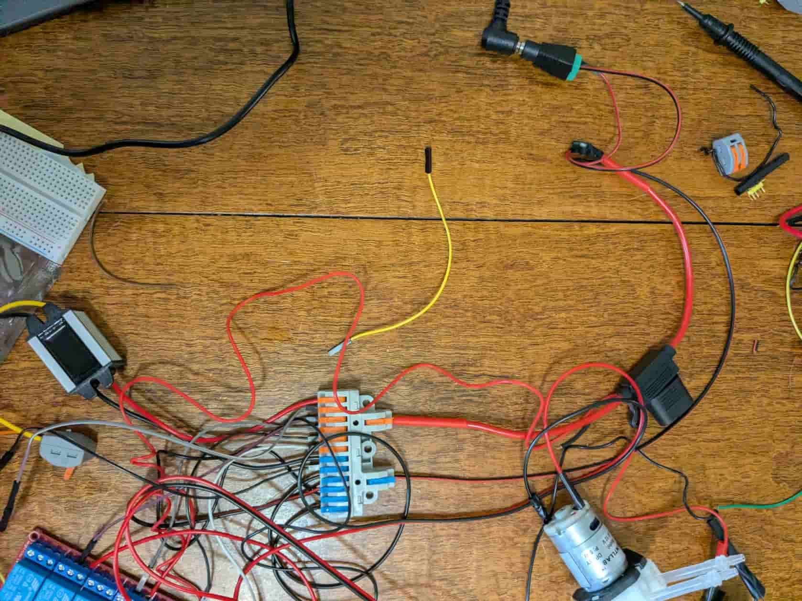
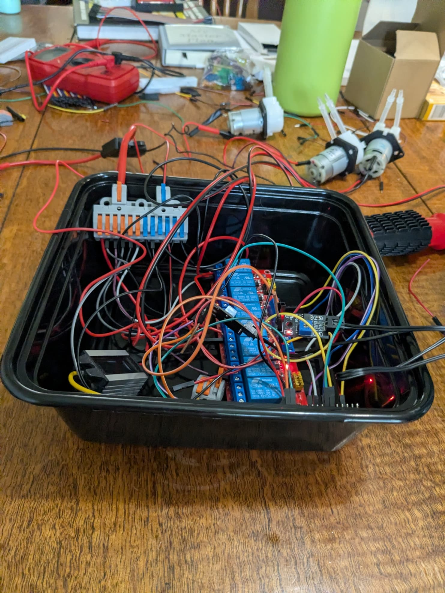
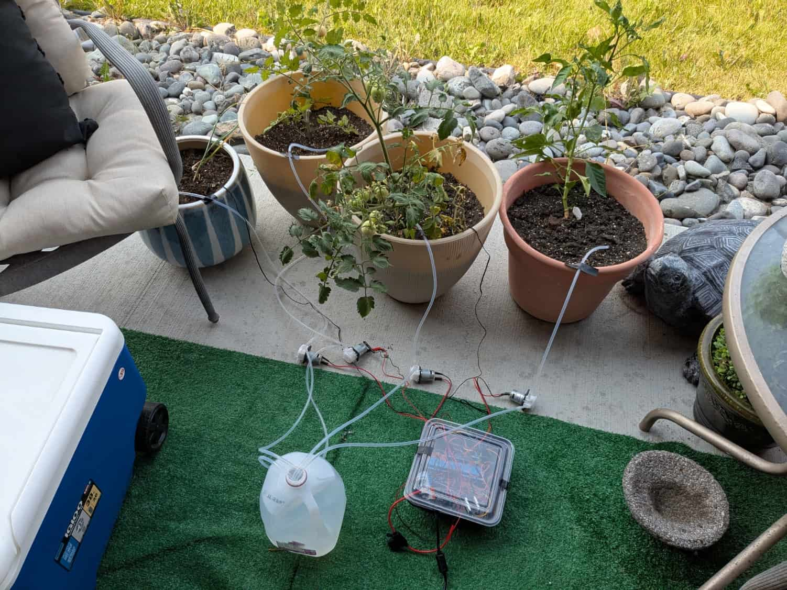

# GardenSCADA
Automated plant watering is step 1, more to come... 
  
# Automated Garden Watering System

A soil-moisture-driven watering system built around an ESP32, an 8-channel relay board, and 12V peristaltic pumps. Checks soil moisture once a day and waters automatically when a plant's soil drops below its threshold.

## What it does

Four planters — two Roma tomatoes, one bell pepper, one garlic — are watered independently by their own pump, but moisture is read by two sensors due to sensor reliability issues encountered mid-build (see below). One sensor sits in a tomato plant and drives the tomato and pepper pumps; the second sensor sits in the garlic and drives that pump alone. Each plant has its own moisture threshold, tuned loosely to how tolerant it is of dry soil. Garlic waters sooner, tomatoes and pepper are allowed to dry down more between waterings.

## Hardware

- ESP32 DevKit V1
- 8-channel relay module (4 channels in use)
- 8x 12V DC peristaltic pumps (4 in use)
- 2x capacitive soil moisture sensors
- 12V 10A wall adapter, inline 5A fuse, 12V→5V buck converter
- Weatherproof* plastic housing for the electronics

  *hopefully. Weather resistant, severe storms could be a problem.

## Architecture

```
Wall adapter (12V) → fuse → splits into:
  ├── Relay board load-side (COM terminals, one per pump)
  ├── Relay board coil power (DC+/DC−)
  └── Buck converter (12V → 5V) → ESP32 VIN → 2x moisture sensors 
```

The ESP32 reads both moisture sensors on a daily interval, compares each against a per-plant threshold, and switches the relevant relay channel(s) on for a fixed watering duration. Pumps are wired through the relay's NO (normally open) contacts, so the system fails safe ( any crash leaves pumps off rather than running continuously). Programed to water iteratively rather than in parallel. 

## Status

Fully wired, tested, and deployed outdoors for the remainder of the growing season.

## Potential next steps

- MQTT (Sparkplug B) integration for remote monitoring
- Edge broker on a Raspberry Pi, SCADA layer in Ignition (Tag Historian, alarming, dashboards)
- Security hardening: WireGuard VPN, TLS-secured MQTT, audit logging. Currently secure due to no internet connection.
- Scaling this architecture up for a family member's large greenhouse build in the coming year

## Why I built this

I wanted a hands-on electronics project. I wanted to actually finish something end-to-end — sensors, control logic, relays, and real hardware, not just software or an architecture mapped in theory. Longer write-up with lessons learned [here](https://ethancearlock.dev/projects/automated-garden).

#Diagram and pictures:
 



#Helpful resources: 
ESP info: https://lastminuteengineers.com/esp32-pinout-reference/#esp32-pinout 
Claude for clarifying questions on principles of electricity and boilerplate code.
Arduino IDE

